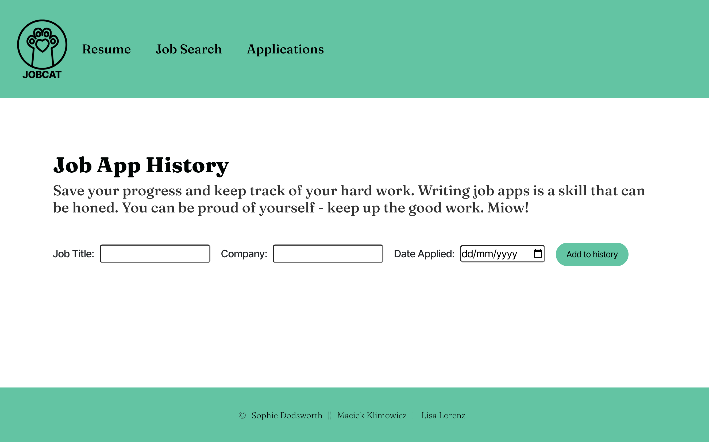

# JobCat - Resume App

  [](https://opensource.org/licenses/MIT)<br>

A project built from scratch with React, Bootstrap, and CSS - that helps you stay on top of your job search - with a kitty cat!

## Table of contents
1. [Getting Started](#toc-gettingstarted)
2. [Summary](#toc-summary)
3. [App Description](#toc-appdescription)
4. [Usage](#toc-usage)
5. [Screenshot](#toc-screenshot)
6. [License](#toc-license)
7. [Collaborators](#toc-collaborators)
8. [Contribute](#toc-contribute)
9. [Tests](#toc-tests)
10. [FAQ](#toc-faq)
11. [Contact](#toc-contact)


## Getting Started <a name="toc-gettingstarted"></a>
This application requires [React](https://www.youtube.com/watch?v=jp1sQZPQ_Rw) use the following commands to get started.

[Have a look at this tutorial](https://github.com/gitname/react-gh-pages) that shows you how to get started with React. You will need this command to get started:

```javascript
npm start
```

And make sure you have React Bootstrap in your package:

```javascript
npm install react-bootstrap 
```

## Summary Description <a name="toc-summary"></a>

- Users can search for jobs using an API generated search bar.
- Presents users with the option to either upload their existing resume or generate one by inputting information and choosing from three ready-made designs. The application then generates the CV/Resume with the information inputted and design chosen. 
- The user can keep track of job applications by adding them to an editable list


## User Story

As a job seeker...

I want to create a resume, apply for jobs and keep track of my job applications, all in one place...

so that I can be organised and stay on top of my job search.

## App description <a name="toc-appdescription"></a>

Introducing JobCat - the all-in-one job application platform that helps you create a stunning resume, apply for your dream job with just a few clicks, and keep track of all your job applications in one place. Say goodbye to the hassle of job hunting and hello to a seamless and stress-free job search experience. Whether you're a recent graduate, a seasoned professional, or anyone in between, JobCat has everything you need to land your dream job. 


## Usage <a name="toc-usage"></a>


## Screenshot <a name="toc-screenshot"></a>




## License <a name="toc-license"></a>

This project is licensed under the MIT license.


## Collaborators <a name="toc-collaborate"></a>

Maciek, Sophie, and Lisa - [Lisa Lorenz](https://github.com/LisaMLorenz). 


## How to Contribute <a name="toc-contribute"></a>
If you would like to contribute to this project, please follow these steps:

1. Fork the repository.
2. Create a new branch.
3. Make your changes and commit them.
4. Push your changes to your fork.
5. Submit a pull request.


## Any more questions? <a name="toc-contact"></a>